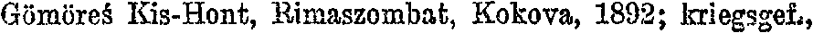
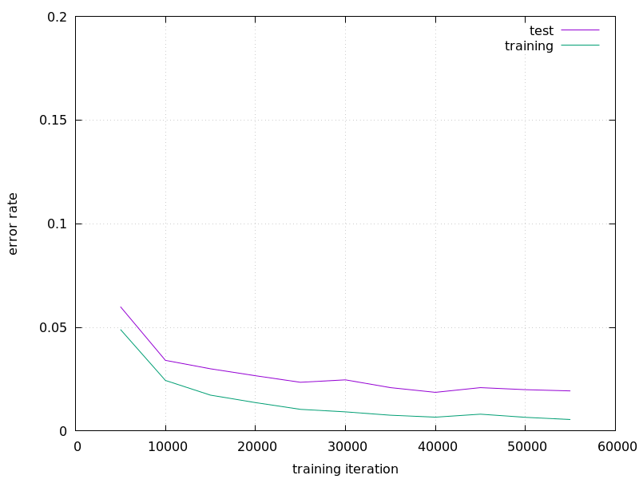

# ocropus-model_oesterreich-ungarn

This OCROpus model can be used to recognize the WW1 casualty lists of Austria-Hungary (Verlustlisten Österreich-Ungarn). 

The model is trained from scratch because of the various diacritical signs. You can find data for training and testing in the correspondent directories. This figure depicts the progression of the error rate during the training process:

The model here is iteration 18,000. The data for the plot as well as a Gnuplot script is also contained in the root directory.

I have used the scans from the Landesbibliothek Oberösterreich
http://digi.landesbibliothek.at

